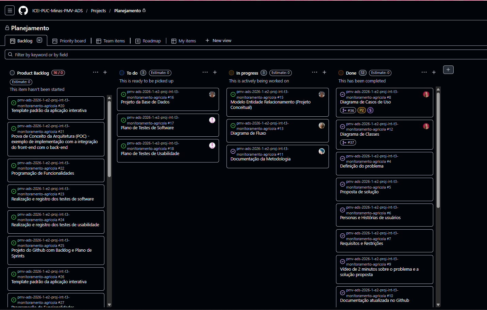

# Metodologia

Pré-requisitos: <a href="2-Especificação do Projeto.md"> Documentação de Especificação</a>

O desenvolvimento do projeto **Agro Conecta** segue princípios ágeis, com foco em colaboração, entregas contínuas e adaptação ao longo do processo. A equipe adota o **Kanban** como principal metodologia de organização, permitindo visualizar o fluxo de trabalho e acompanhar o andamento das tarefas de forma clara.

Apesar de contar com um Scrum Master, o time não utiliza o Scrum de forma tradicional com sprints fixas. O papel do Scrum Master está mais voltado para facilitar a comunicação, remover impedimentos e apoiar a equipe na organização das atividades, garantindo fluidez no processo.

Os ambientes de trabalho incluem ferramentas para versionamento de código, organização de tarefas, comunicação e prototipação, proporcionando integração entre todas as etapas do projeto.

---

## Controle de Versão

A ferramenta de controle de versão adotada no projeto é o
[Git](https://git-scm.com/), sendo que o [Github](https://github.com)
é utilizado para hospedagem do repositório.

A estratégia de versionamento utilizada é simplificada e adaptável às necessidades da equipe. A branch principal é:

- `main`: versão estável e consolidada do sistema  

Além disso, são criadas branches temporárias conforme a necessidade para desenvolvimento de funcionalidades, correções ou melhorias.

O fluxo de trabalho inclui:

- Criação de branches para desenvolvimento de tarefas específicas  
- Realização de commits frequentes para registro das alterações  
- Abertura de *pull requests* para revisão antes da integração  
- Merge na branch principal após validação  

A gestão das issues é feita de forma flexível, categorizando as atividades de acordo com seu tipo, como:

- desenvolvimento de funcionalidades  
- correção de erros  
- melhorias no sistema  
- ajustes na documentação  

Essa abordagem permite maior autonomia ao time e evita excesso de formalidade no processo.

> **Links Úteis**:
> - [Tutorial GitHub](https://guides.github.com/activities/hello-world/)
> - [Git e Github](https://www.youtube.com/playlist?list=PLHz_AreHm4dm7ZULPAmadvNhH6vk9oNZA)
> - [Comparando fluxos de trabalho](https://www.atlassian.com/br/git/tutorials/comparing-workflows)
> - [Understanding the GitHub flow](https://guides.github.com/introduction/flow/)
> - [The gitflow workflow - in less than 5 mins](https://www.youtube.com/watch?v=1SXpE08hvGs)

---

## Gerenciamento de Projeto

### Divisão de Papéis

A equipe do projeto **Agro Conecta** está organizada da seguinte forma:

- **Product Owner**: Rodrigo Felix Gomes  
- **Scrum Master**: Mateus da Cunha Tito  
- **Desenvolvedores**:  
  - Elizabeth França Vaz dos Santos  
  - Maria Eduarda Pacheco Meireles  
  - Rafaela Parolini Fragnan  
- **QA (Qualidade)**:  
  - Anna Clara dos Santos  

Todos os membros colaboram de forma integrada, contribuindo tanto no desenvolvimento quanto na evolução contínua do projeto.

---

### Processo

A organização das atividades é realizada por meio de um quadro Kanban, estruturado para refletir o fluxo de trabalho da equipe. As principais etapas são:

- **Backlog**: lista geral de demandas e funcionalidades identificadas  
- **A Fazer**: tarefas priorizadas prontas para execução  
- **Em Andamento**: atividades em desenvolvimento  
- **Concluído**: tarefas finalizadas e validadas  

As tarefas são priorizadas de acordo com o valor para o produto e são atualizadas continuamente. A equipe realiza alinhamentos frequentes para acompanhamento do progresso, identificação de impedimentos e ajustes de prioridades.

---

### Ferramentas

As ferramentas utilizadas no projeto são:

- **GitHub**: versionamento de código e gerenciamento das atividades  
- **GitHub Projects (Kanban)**: organização e acompanhamento das tarefas  
- **Visual Studio Code**: desenvolvimento do código-fonte  
- **Figma**: criação de protótipos e interfaces  
- **WhatsApp / Teams**: comunicação entre os membros da equipe  

As ferramentas foram escolhidas com base na integração entre elas e na familiaridade da equipe, contribuindo para um fluxo de trabalho mais eficiente. O GitHub centraliza o código e as tarefas, o Figma permite colaboração em tempo real no design, e as ferramentas de comunicação garantem agilidade nos alinhamentos do dia a dia.

